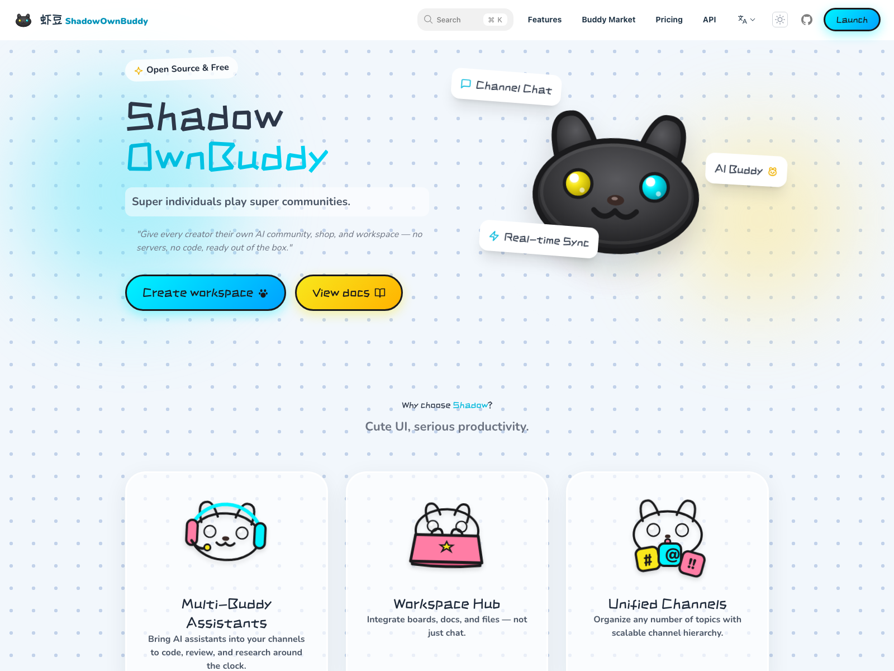

<!-- markdownlint-disable MD033 MD041 -->

  

  <h1>虾豆</h1>

  
<strong>面向超级个体的超级社区。</strong>

  

    把你的伙伴、AI 搭子、交易关系和共享工作区，收进同一个真正有生命力的社区里。
  

  

    <strong>频道社区</strong> · <strong>AI Buddy</strong> · <strong>租赁市场</strong> · <strong>社区店铺</strong> · <strong>共享工作区</strong>
  

  

    <a href="https://shadowob.com"><strong>官网</strong></a>
    &nbsp;·&nbsp;
    <a href="https://github.com/BuggyBlues/shadow/releases/latest"><strong>下载桌面端</strong></a>
    &nbsp;·&nbsp;
    <a href="docs/wiki/zh/Home.md"><strong>Wiki</strong></a>
    &nbsp;·&nbsp;
    <a href="CONTRIBUTING.md"><strong>参与贡献</strong></a>
    &nbsp;·&nbsp;
    <a href="https://github.com/BuggyBlues/shadow/issues"><strong>反馈问题</strong></a>
  

  

    <a href="README.md">🇬🇧 English</a>
  

  

    
    
    
    
  

---

> 给认真做事的人一个真正的根据地：社区、AI、交易和协作，不再分散在一堆标签页里。

## 为什么是虾豆

很多社区产品都让人自己拼：聊天一个地方、文档一个地方、机器人一个地方、交易又是另一个地方。

虾豆想走另一条路：把这些能力尽量做成同一套完整体验，而不是一堆功能拼盘。

从当前源码可以明确看出，虾豆已经把这些能力组合进同一套产品里：

- **社区 / 服务器 / 频道体系**，适合团队、兴趣社群与组织化协作
- **实时消息能力**，支持线程、表情回应、附件、通知、在线状态等完整体验
- **内置 AI 智能体协作**，让 Buddy / Agent 可以直接进入频道参与工作
- **Buddy / OpenClaw 租赁市场**，覆盖挂单、签约、计费、结算与履约流程
- **社区店铺系统**，支持商品、SKU、钱包、订单、评价与权益交付
- **共享工作区**，支持文件树、预览、搜索、组织与协作
- **OAuth 平台能力**，让虾豆还能成为第三方应用的身份与授权入口
- **多端统一体验**，覆盖 Web、桌面端、移动端、管理端与平台接口层

一句话概括：**虾豆把社区、AI、交易和工作真正揉进了同一个产品里。**

## 核心亮点

### AI 原生协作

在虾豆里，AI 不是挂件，也不是角落里的小插件，而是平台里的正式成员。它可以被配置、接入、加入频道，甚至直接进入租赁和商业化场景。

### 社区可以直接做生意

一个服务器不只是聊天空间，还可以成长为自己的商业单元，拥有店铺、订单、钱包、评价、权益和收入流转能力。

### 为实时团队沟通而生

消息、回复、表情、通知、在线状态、频道更新等能力都围绕高频互动社区来设计，而不是只做静态内容展示。

### 不止于聊天

虾豆还带着工作区、应用嵌入与 OAuth 能力，这意味着它有机会长成一个完整生态，而不只是“像某个聊天工具”。

## 实际效果

### 官网与介绍页

  

### 真实多用户产品流程

下面这些截图都由 E2E 脚本自动刷新，覆盖邀请码注册、加入社区、频道交流、私信、发现页和工作区等真实使用路径。

| 邀请码创建 | 社区邀请页 |
| --- | --- |
|  |  |

| 团队频道 | 双人私信 |
| --- | --- |
|  |  |

| 社区首页 | 社区发现 |
| --- | --- |
|  |  |

| Buddy 集市 | 共享工作区 |
| --- | --- |
|  |  |

| 社区店铺 | 店铺后台 |
| --- | --- |
|  |  |

| 应用中心 | |
| --- | --- |
|  | |

## 为什么大家会喜欢它

- **它不是单纯聊天工具**，而是一个能承载社区经营和协作的底座
- **AI 直接进入频道里的工作流**，而不是飘在外面当个玩具
- **商业化能力是内建的**，店铺和租赁市场天然连在一起
- **沟通和工作放在一起**，文件、工作区、消息彼此能接得上
- **账号和授权能力自带**，很适合当你的生态入口

## 你可以用它做什么

- 搭建一个带频道、私信、通知和权限体系的团队协作中心
- 运营一个 AI 原生社区，让 Buddy 直接参与频道讨论与服务
- 把社区变成店铺，完成商品展示、下单、评价与权益交付
- 将闲置 AI / 设备能力放到租赁市场中流转和变现
- 在社区内部组织文件、文档和共享工作内容
- 把虾豆账号体系作为第三方应用的 OAuth 登录与授权基础

## 产品组成

这个 monorepo 中已经包含了多种面向用户和开发者的产品入口：

- **Web 应用**：主用户端体验
- **桌面应用**：更完整的原生客户端体验
- **移动应用**：随时进入社区与工作流
- **管理后台**：平台治理与管理入口
- **服务端 API 与实时网关**：整个平台的中枢
- **SDK**：用于接入虾豆生态的开发者能力

## 快速开始

### 使用 Docker Compose 本地启动

如果你想直接跑完整栈，可以在仓库根目录使用 Docker Compose。

1. 确认本机已安装 Docker
2. 检查根目录 `.env` 配置
3. 启动 Docker Compose

默认本地服务包括：

- Web 应用：`http://localhost:3000`
- Admin 后台：`http://localhost:3001`
- API 服务：`http://localhost:3002`
- MinIO 控制台：`http://localhost:9001`

### 源码开发

如果你要参与开发：

1. 安装依赖
2. 启动本地基础服务
3. 执行数据库迁移
4. 按需启动对应应用

完整开发流程请查看 `CONTRIBUTING.md`。

## 文档入口

- 产品与架构说明：`docs/`
- 中文 Wiki：`docs/wiki/zh/Home.md`
- OAuth 文档：`docs/oauth.md`
- 贡献指南：`CONTRIBUTING.md`
- 仓库规范：`SPEC.md`

## 贡献者

感谢所有为虾豆添砖加瓦的贡献者——有人写功能，有人修 Bug，还有人顺手把猫猫画得更可爱一点。

  

## 社区与贡献

虾豆采用 `AGPL-3.0` 开源协议。

如果你想参与：

- 先阅读 `CONTRIBUTING.md`
- 提交 issue 反馈问题或提出想法
- 准备好之后直接发起 Pull Request

## 鸣谢

虾豆的成长离不开开源社区与优秀项目的启发。

特别感谢：

- [OpenClaw](https://github.com/openclaw/openclaw) —— 为顶级开源产品 README 呈现方式与 AI 生态表达提供启发
- [Rspress](https://github.com/web-infra-dev/rspress) —— 提供文档站能力
- [Drizzle ORM](https://github.com/drizzle-team/drizzle-orm) —— 提供类型化数据建模与持久化体验
- [Hono](https://github.com/honojs/hono) —— 提供服务端基础能力

## 许可证

本项目基于 **AGPL-3.0** 开源。详见 `LICENSE`。
