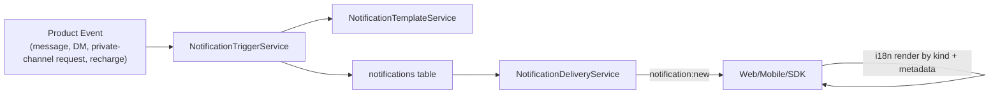

# Notification System Refactor

> **Status:** Implemented baseline
> **Date:** 2026-05-02
> **Scope:** In-app notification center, IM real-time notifications, system notifications, private-channel access requests

## Problem

Shadow notifications had grown from multiple independent product paths: chat mentions, replies, DMs, friendship requests, server joins, recharge success, and private-channel approval. That created four systemic risks:

1. Notification records had only coarse `type` values and text fields, so clients had to infer product behavior from title/body strings.
2. Creation and Socket.IO delivery were scattered across handlers and gateways.
3. Unread state could not be reliably scoped to server/channel/DM, which made sidebars and notification center counts drift.
4. Private channels can be mentioned, but joining them needs an approval wall. That approval flow needs first-class notification events instead of ad hoc system messages.

## Research Notes

Evaluated options:

| Option | Useful For | Decision |
|--------|------------|----------|
| [Novu](https://docs.novu.co/) | Cross-channel notification workflows, hosted inbox, e-mail/SMS/push providers | Do not introduce in this pass. Shadow needs RBAC-aware in-app records tied to server/channel/DM permissions; outsourcing the primary inbox now would duplicate state and complicate private-channel gates. |
| [BullMQ](https://docs.bullmq.io/) | Redis-backed job queue, retry, delayed push, horizontal workers | Keep as the preferred future queue layer for offline push fanout, receipts, and retries. The current in-app path is synchronous DB + Socket.IO because it must update unread state immediately. |
| [Expo Push Notifications](https://docs.expo.dev/push-notifications/overview/) | Android/iOS push delivery through Expo | Good fit for mobile offline push after `user_push_tokens` exists. This refactor prepares stable event metadata but does not add token storage yet. |
| [Centrifugo](https://centrifugal.dev/docs/getting-started/introduction) | High-throughput real-time pub/sub with presence and channel auth | Useful if Socket.IO becomes the scaling bottleneck. Not required for the baseline because current channel/user room semantics are already integrated. |

## Decision

Shadow keeps an owned notification event model and central trigger service as the source of truth:

### Event Fields

Each notification record carries:

| Field | Purpose |
|-------|---------|
| `kind` | Stable semantic event name, for example `message.mention`, `dm.message`, `channel.access_requested`. |
| `type` | Legacy coarse bucket: `mention`, `reply`, `dm`, `system`. |
| `scopeServerId` | Server-level unread and mute scope. |
| `scopeChannelId` | Channel-level unread and mute scope. Private-channel notifications still use this scope; message content access remains guarded elsewhere. |
| `scopeDmChannelId` | DM unread scope. |
| `aggregationKey`, `aggregatedCount`, `lastAggregatedAt` | Five-minute aggregation window for noisy events such as mentions, replies, DMs, and server joins. |
| `metadata` | Structured rendering payload. Clients render localized copy from `kind + metadata`; stored `title/body` are fallback text only. |

### Trigger Ownership

Only `NotificationTriggerService` should create product notifications. Handlers/gateways call typed trigger methods:

- `triggerMention`
- `triggerReply`
- `triggerDm`
- `triggerChannelAccessRequest`
- `triggerChannelAccessDecision`
- `triggerChannelMemberAdded`
- `triggerServerMemberJoined`
- `triggerServerInvite`
- `triggerFriendRequest`
- `triggerRechargeSucceeded`

Direct calls to `notificationDao.create`, manual title construction in handlers, or manual `io.to(user).emit('notification:new')` should be treated as architectural debt unless they are inside the notification services.

## Private Channel Invitations

Private channels are mentionable, but membership is still a wall:

1. A non-member server member can mention or see a private channel reference.
2. Reading/sending/joining a private channel requires channel membership, server owner/admin, or approved access request.
3. `POST /api/channels/:id/join-requests` creates `channel.access_requested` notifications for server owners/admins and existing channel members.
4. `PATCH /api/channel-join-requests/:requestId` creates either `channel.access_approved` or `channel.access_rejected` for the requester.
5. Message filtering is not relaxed by notification delivery. Notifications point to the scope; message reads still use the normal channel access gate.

## Client Contract

Clients should:

- Listen for `notification:new`.
- Store/read notification records through `/api/notifications`.
- Render title/body through i18n using `kind` and `metadata`.
- Use `/api/notifications/scoped-unread` for sidebar badges.
- Use `/api/notifications/read-scope` with `serverId`, `channelId`, or `dmChannelId` when entering a scope.

## Performance Notes

- Scope indexes are present for server/channel/DM unread scans.
- Aggregation updates an existing unread row inside the configured window to avoid notification spam.
- The synchronous path is intentionally small: render fallback text, persist/aggregate, emit to the user room.
- Offline push should be implemented as an outbox job when push tokens exist. BullMQ is the recommended queue layer for retry and receipt cleanup rather than hand-rolled timers.

## Testing Requirements

Required coverage for this system:

- Unit tests for preference filtering, aggregation, scoped unread counts, and user-scoped mark-read.
- Unit tests for trigger methods and private-channel reviewer fanout.
- Socket/REST integration coverage for private-channel request and approval notifications.
- SDK tests for `read-all`, `read-scope`, and DM scope support in both TypeScript and Python clients.
